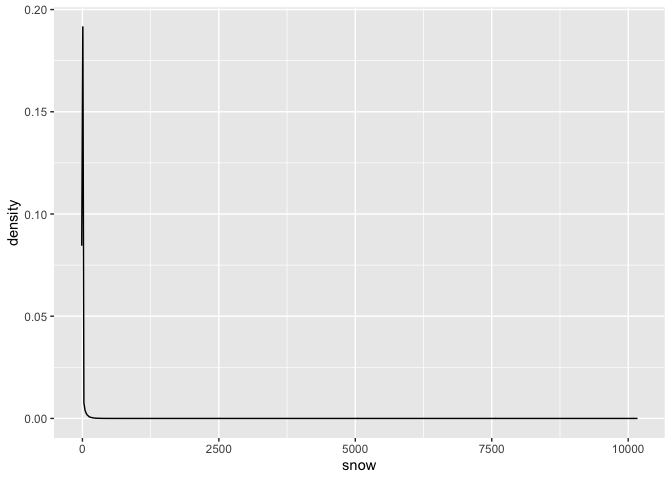

p8105_hw3_ag2965
================
Aakriti Shukla
2022-10-06

Let’s load the necessary libraries.

``` r
library(tidyverse)
```

    ## ── Attaching packages ─────────────────────────────────────── tidyverse 1.3.2 ──
    ## ✔ ggplot2 3.3.6      ✔ purrr   0.3.4 
    ## ✔ tibble  3.1.8      ✔ dplyr   1.0.10
    ## ✔ tidyr   1.2.0      ✔ stringr 1.4.1 
    ## ✔ readr   2.1.2      ✔ forcats 0.5.2 
    ## ── Conflicts ────────────────────────────────────────── tidyverse_conflicts() ──
    ## ✖ dplyr::filter() masks stats::filter()
    ## ✖ dplyr::lag()    masks stats::lag()

``` r
library(patchwork)
library(p8105.datasets)
data("instacart")
```

The goal is to do some exploration of the instacart dataset. To that
end, write a short description of the dataset, noting the size and
structure of the data, describing some key variables, and giving
illstrative examples of observations. Then, do or answer the following
(commenting on the results of each):

How many aisles are there, and which aisles are the most items ordered
from?

There are 134 aisles. The most items are ordered from the fresh fruits
and fresh vegetables aisles.

``` r
data("instacart")

instacart = 
  instacart %>% 
  as_tibble(instacart)

instacart%>%
  janitor::clean_names()%>%
  summarize(
    n_distinct(aisle_id))
```

    ## # A tibble: 1 × 1
    ##   `n_distinct(aisle_id)`
    ##                    <int>
    ## 1                    134

``` r
instacart%>%
  count(aisle)%>%
  filter(n>100000)
```

    ## # A tibble: 2 × 2
    ##   aisle                 n
    ##   <chr>             <int>
    ## 1 fresh fruits     150473
    ## 2 fresh vegetables 150609

Make a plot that shows the number of items ordered in each aisle,
limiting this to aisles with more than 10000 items ordered. Arrange
aisles sensibly, and organize your plot so others can read it.

``` r
instacart%>%
  count(aisle)%>%
  filter(n>10000)%>%
  mutate(aisle=fct_reorder(aisle,n))%>%
  ggplot(aes(x=aisle, y=n))+
  geom_point()+
  labs(title = "Number of items ordered in each aisle",
       y="number of items") +
  theme(axis.text.x = element_text(angle = 60, hjust = 1))
```

<!-- -->

Make a table showing the three most popular items in each of the aisles
“baking ingredients”, “dog food care”, and “packaged vegetables fruits”.
Include the number of times each item is ordered in your table.

``` r
instacart%>%
  filter(aisle %in% c("baking ingredients","dog food care","packaged vegetables fruits"))%>%
  group_by(aisle)%>%
  count(product_name)%>%
  mutate(rank=min_rank(desc(n)))%>%
  filter(rank<4)%>%
  arrange(desc(n))%>%
  knitr::kable()
```

| aisle                      | product_name                                  |    n | rank |
|:---------------------------|:----------------------------------------------|-----:|-----:|
| packaged vegetables fruits | Organic Baby Spinach                          | 9784 |    1 |
| packaged vegetables fruits | Organic Raspberries                           | 5546 |    2 |
| packaged vegetables fruits | Organic Blueberries                           | 4966 |    3 |
| baking ingredients         | Light Brown Sugar                             |  499 |    1 |
| baking ingredients         | Pure Baking Soda                              |  387 |    2 |
| baking ingredients         | Cane Sugar                                    |  336 |    3 |
| dog food care              | Snack Sticks Chicken & Rice Recipe Dog Treats |   30 |    1 |
| dog food care              | Organix Chicken & Brown Rice Recipe           |   28 |    2 |
| dog food care              | Small Dog Biscuits                            |   26 |    3 |

Make a table showing the mean hour of the day at which Pink Lady Apples
and Coffee Ice Cream are ordered on each day of the week; format this
table for human readers (i.e. produce a 2 x 7 table).

``` r
instacartprob1=instacart%>%
   filter(product_name %in% c("Pink Lady Apples","Coffee Ice Cream"))%>%
  group_by(product_name,order_dow)%>%
  summarize(mean(order_hour_of_day))%>%
  mutate(
      order_dow=recode(order_dow,"0"="Sunday", "1"="Monday", "2"="Tuesday","3"="Wednesday","4"="Thursday","5"="Friday", "6"="Saturday"))%>%
  pivot_wider(
    names_from = "order_dow",
    values_from = "mean(order_hour_of_day)"
  )%>%
 knitr::kable()
```

    ## `summarise()` has grouped output by 'product_name'. You can override using the
    ## `.groups` argument.

``` r
head(instacartprob1)
```

    ## [1] "|product_name     |   Sunday|   Monday|  Tuesday| Wednesday| Thursday|   Friday| Saturday|"
    ## [2] "|:----------------|--------:|--------:|--------:|---------:|--------:|--------:|--------:|"
    ## [3] "|Coffee Ice Cream | 13.77419| 14.31579| 15.38095|  15.31818| 15.21739| 12.26316| 13.83333|"
    ## [4] "|Pink Lady Apples | 13.44118| 11.36000| 11.70213|  14.25000| 11.55172| 12.78431| 11.93750|"

Problem 2 Accelerometers have become an appealing alternative to
self-report techniques for studying physical activity in observational
studies and clinical trials, largely because of their relative
objectivity. During observation periods, the devices measure “activity
counts” in a short period; one-minute intervals are common. Because
accelerometers can be worn comfortably and unobtrusively, they produce
around-the-clock observations.

This problem uses five weeks of accelerometer data collected on a 63
year-old male with BMI 25, who was admitted to the Advanced Cardiac Care
Center of Columbia University Medical Center and diagnosed with
congestive heart failure (CHF). The data can be downloaded here. In this
spreadsheet, variables activity.\* are the activity counts for each
minute of a 24-hour day starting at midnight.

``` r
accel_data = read_csv("data/accel_data.csv")%>%
  janitor::clean_names()%>%
   pivot_longer(
    activity_1:activity_1440,
    names_to="minutes",
    values_to="activity",
    names_prefix="activity_")%>%
  mutate(
    day=as.factor(day),
    activity=as.numeric(activity),
    minutes=as.numeric(minutes),
    day_type= recode(day,"Monday"="weekday", "Tuesday"="weekday",  "Wednesday"="weekday", "Thursday"="weekday", "Friday"="weekday", "Saturday"="weekend", "Sunday"="weekend"))
```

    ## Rows: 35 Columns: 1443
    ## ── Column specification ────────────────────────────────────────────────────────
    ## Delimiter: ","
    ## chr    (1): day
    ## dbl (1442): week, day_id, activity.1, activity.2, activity.3, activity.4, ac...
    ## 
    ## ℹ Use `spec()` to retrieve the full column specification for this data.
    ## ℹ Specify the column types or set `show_col_types = FALSE` to quiet this message.

``` r
head(accel_data)
```

    ## # A tibble: 6 × 6
    ##    week day_id day    minutes activity day_type
    ##   <dbl>  <dbl> <fct>    <dbl>    <dbl> <fct>   
    ## 1     1      1 Friday       1     88.4 weekday 
    ## 2     1      1 Friday       2     82.2 weekday 
    ## 3     1      1 Friday       3     64.4 weekday 
    ## 4     1      1 Friday       4     70.0 weekday 
    ## 5     1      1 Friday       5     75.0 weekday 
    ## 6     1      1 Friday       6     66.3 weekday

Above, I have loaded and tidied the data. The dataset includes all
originally observed variables and values, has useful variable names, and
includes a weekday vs weekend variable. The resulting dataset has 50400
rows and 6 columns in the dataset. The variables include week number,
day of the week, minute of the day, activity at each minute of the day,
and whether the day of the week is a weekday or weekend. There are a
total of 5 weeks in which the accelerometer is worn. The range of the
activity variable is 1, 8982.

Below, I have wrangled the data to focus on the total activity over the
day. Using my tidied dataset, I have aggregated across minutes to create
a total activity variable for each day, and create a table showing these
totals. This table suggests that activity levels tend to be higher on
Fridays than on the other days of the week.

``` r
accel_data_agg=read_csv("data/accel_data.csv")%>%
  janitor::clean_names()%>%
   pivot_longer(
    activity_1:activity_1440,
    names_to="minutes",
    values_to="activity",
    names_prefix="activity_")%>%
  mutate(
    day=as.factor(day),
    activity=as.numeric(activity),
    minutes=as.numeric(minutes),
    day_id=as.factor(day_id))%>%
    group_by(week,day)%>%
  summarize(sum(activity))%>%
  ungroup(week,day)%>%
   mutate(
        day = forcats::fct_relevel(day, "Sunday", "Monday", "Tuesday","Wednesday","Thursday","Friday","Saturday"))%>%
  pivot_wider(
    names_from="day",
    values_from="sum(activity)")%>%
knitr::kable(digit=2)
```

    ## Rows: 35 Columns: 1443
    ## ── Column specification ────────────────────────────────────────────────────────
    ## Delimiter: ","
    ## chr    (1): day
    ## dbl (1442): week, day_id, activity.1, activity.2, activity.3, activity.4, ac...
    ## 
    ## ℹ Use `spec()` to retrieve the full column specification for this data.
    ## ℹ Specify the column types or set `show_col_types = FALSE` to quiet this message.
    ## `summarise()` has grouped output by 'week'. You can override using the `.groups` argument.

``` r
head(accel_data_agg)
```

    ## [1] "| week|   Friday|    Monday| Saturday| Sunday| Thursday|  Tuesday| Wednesday|"
    ## [2] "|----:|--------:|---------:|--------:|------:|--------:|--------:|---------:|"
    ## [3] "|    1| 480542.6|  78828.07|   376254| 631105| 355923.6| 307094.2|    340115|"
    ## [4] "|    2| 568839.0| 295431.00|   607175| 422018| 474048.0| 423245.0|    440962|"
    ## [5] "|    3| 467420.0| 685910.00|   382928| 467052| 371230.0| 381507.0|    468869|"
    ## [6] "|    4| 154049.0| 409450.00|     1440| 260617| 340291.0| 319568.0|    434460|"

Accelerometer data allows the inspection activity over the course of the
day. Below, I have made a single-panel plot that shows the 24-hour
activity time courses for each day. The plot suggests that activity
levels are lowest overnight and have a bimodal distribution during the
waking part of the day, with highest levels in the morning and evening
and a slight dip in activity in the middle of the day.

``` r
accel_data_24=read_csv("data/accel_data.csv")%>%
  janitor::clean_names()%>%
   pivot_longer(
    activity_1:activity_1440,
    names_to="minutes",
    values_to="activity",
    names_prefix="activity_")%>%
  mutate(
    day=as.factor(day),
    activity=as.numeric(activity),
    minutes=as.numeric(minutes),
    day_type= recode(day,"Monday"="weekday", "Tuesday"="weekday",  "Wednesday"="weekday", "Thursday"="weekday", "Friday"="weekday", "Saturday"="weekend", "Sunday"="weekend"))
```

    ## Rows: 35 Columns: 1443
    ## ── Column specification ────────────────────────────────────────────────────────
    ## Delimiter: ","
    ## chr    (1): day
    ## dbl (1442): week, day_id, activity.1, activity.2, activity.3, activity.4, ac...
    ## 
    ## ℹ Use `spec()` to retrieve the full column specification for this data.
    ## ℹ Specify the column types or set `show_col_types = FALSE` to quiet this message.

``` r
accel_data_24%>%
  ggplot(aes(x=minutes,y=activity,color=day))+
  geom_smooth(se = FALSE)+
labs(
  x="Minute of Day",
  y="Activity Level",
  title="Activity Level by Time of Day",
  caption="Data came from accel_data package"
)
```

    ## `geom_smooth()` using method = 'gam' and formula 'y ~ s(x, bs = "cs")'

<!-- -->

``` r
head(accel_data_24)
```

    ## # A tibble: 6 × 6
    ##    week day_id day    minutes activity day_type
    ##   <dbl>  <dbl> <fct>    <dbl>    <dbl> <fct>   
    ## 1     1      1 Friday       1     88.4 weekday 
    ## 2     1      1 Friday       2     82.2 weekday 
    ## 3     1      1 Friday       3     64.4 weekday 
    ## 4     1      1 Friday       4     70.0 weekday 
    ## 5     1      1 Friday       5     75.0 weekday 
    ## 6     1      1 Friday       6     66.3 weekday

\#Problem 3

We will first load the necessary dataset.

``` r
library(p8105.datasets)
data("ny_noaa")
```

The goal is to do some exploration of this dataset. To that end, write a
short description of the dataset, noting the size and structure of the
data, describing some key variables, and indicating the extent to which
missing data is an issue. Then, do or answer the following (commenting
on the results of each):

This data from The National Oceanic and Atmospheric Association (NOAA)
includes the weather station ID, date of observation, precipitation in
tenths of mm, snowfall in mm, snow depth in mm, and maximum and minimum
temperatures in tenths of degrees Celsius. There are 2595176 rows and 7
columns in the dataset. There are many missing values in this dataset.

Below, I have done some data cleaning. I have created separate variables
for year, month, and day. I have changed the units of the observations
for temperature to degrees Celsius, precipitation to centimeters,
snowfall to centimeters, snow depth to centimenters; these are now given
in reasonable units. Based on the density plot created below, the most
commonly observed value for snowfall was 0 because the majority of
places did not have snow, or if they did, they did not have the same
levels of snow.

``` r
ny_noaa_tidy=ny_noaa%>%
  janitor::clean_names()%>%
  separate(col=date,into=c('year','month','date'), sep="-")%>%
    mutate(
    month=as.integer(month),
    year=as.integer(year),
    snow=as.numeric(snow),
    month=replace(month, month == "1","January"),
    month=replace(month, month == "2","February"),
    month=replace(month, month == "3","March"),
    month=replace(month, month == "4","April"),
    month=replace(month, month == "5","May"),
    month=replace(month, month == "6","June"),
    month=replace(month, month == "7","July"),
    month=replace(month, month == "8","August"),
    month=replace(month, month == "9","September"),
    month=replace(month, month == "10","October"),
    month=replace(month, month == "11","November"),
    month=replace(month, month == "12","December"),
    prcp=as.numeric(prcp),
    snow=as.numeric(snow),
    snwd=as.numeric(snwd),
    tmax=as.numeric(tmax),
    tmin=as.numeric(tmin),
    prcp=prcp/100,
    snow=snow/10,
    snwd=snwd/10,
    tmax=tmax/10,
    tmin=tmin/10,
    )%>%
  arrange(id,year,month,date,prcp,snow,snwd,tmax,tmin)

head(ny_noaa)
```

    ## # A tibble: 6 × 7
    ##   id          date        prcp  snow  snwd tmax  tmin 
    ##   <chr>       <date>     <int> <int> <int> <chr> <chr>
    ## 1 US1NYAB0001 2007-11-01    NA    NA    NA <NA>  <NA> 
    ## 2 US1NYAB0001 2007-11-02    NA    NA    NA <NA>  <NA> 
    ## 3 US1NYAB0001 2007-11-03    NA    NA    NA <NA>  <NA> 
    ## 4 US1NYAB0001 2007-11-04    NA    NA    NA <NA>  <NA> 
    ## 5 US1NYAB0001 2007-11-05    NA    NA    NA <NA>  <NA> 
    ## 6 US1NYAB0001 2007-11-06    NA    NA    NA <NA>  <NA>

``` r
ggplot(ny_noaa, aes(x = snow))+ 
  geom_density(alpha = .4)
```

    ## Warning: Removed 381221 rows containing non-finite values (stat_density).

<!-- -->

Below, I have made a two-panel plot showing the average max temperature
in January and in July in each station across years. This plot
demonstrates that the average maximum temperature is approximately 25
degrees Celsius warmer in July than January. It appears that the year
1988 had an exceptionally cold month of July, with a maximal temperature
that was about 8 degrees Celsius lower than other years. There is some
variation in temperatures each year, with an overall regression to the
mean.

``` r
ny_noaa_tidy%>%
  arrange(id, year, month)%>%
  group_by(month,year,id)%>%
  summarize(
    tmax_mean=mean(tmax,na.rm=TRUE))%>%
    filter(
      month%in% c("January","July"))%>%
ggplot(aes(x=year,y=tmax_mean, group=id))+
  geom_line(alpha=0.5)+
    facet_grid(.~month)+
labs(
  x="Year",
  y="Average Tmax",
  title="Average Tmax for January and July Across All Centers",
  caption="Data came from ny_noaa package"
)
```

    ## `summarise()` has grouped output by 'month', 'year'. You can override using the
    ## `.groups` argument.

    ## Warning: Removed 5640 row(s) containing missing values (geom_path).

<!-- -->

Below, I have made a two-panel plot showing (i) a scatterplot showing
tmax vs tmin for the full dataset and (ii) a density plot showing the
distribution of snowfall values greater than 0 and less than 100
separately by year.The plots demonstrate that snowfall was less than 40
centimeters in most years.

``` r
tmaxtminplot=ny_noaa_tidy%>%
  drop_na(c(tmax,tmin))%>%
ggplot(aes(x=tmin,y=tmax))+
  geom_hex()+
  labs(
  x="Tmax in degrees C",
  y="Tmin in degrees C",
  title="Tmax vs. Tmin Across All Centers",
  caption="Data came from ny_noaa package"
)

tmaxtminplot
```

<!-- -->

``` r
library(ggridges)
snow_fall=ny_noaa_tidy%>%
  mutate(snow=snow*10)%>%
  filter(0<snow,snow<100)%>%
ggplot(aes(x=snow,y=factor(year)))+
  geom_density_ridges(scale = .85)+
  labs(
  x="Snowfall",
  y="Year",
  title="Snowfall by Year",
  caption="Data came from ny_noaa package"
)

snow_fall
```

    ## Picking joint bandwidth of 3.76

<!-- -->

``` r
library(patchwork)
tmaxtminplot + snow_fall
```

    ## Picking joint bandwidth of 3.76

<!-- -->
